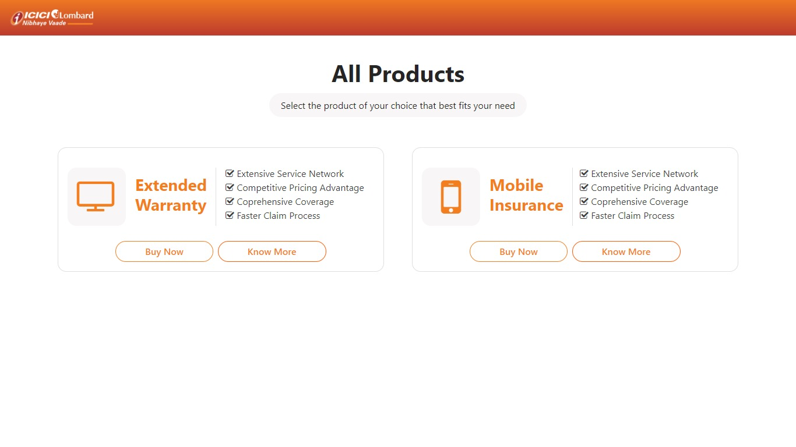
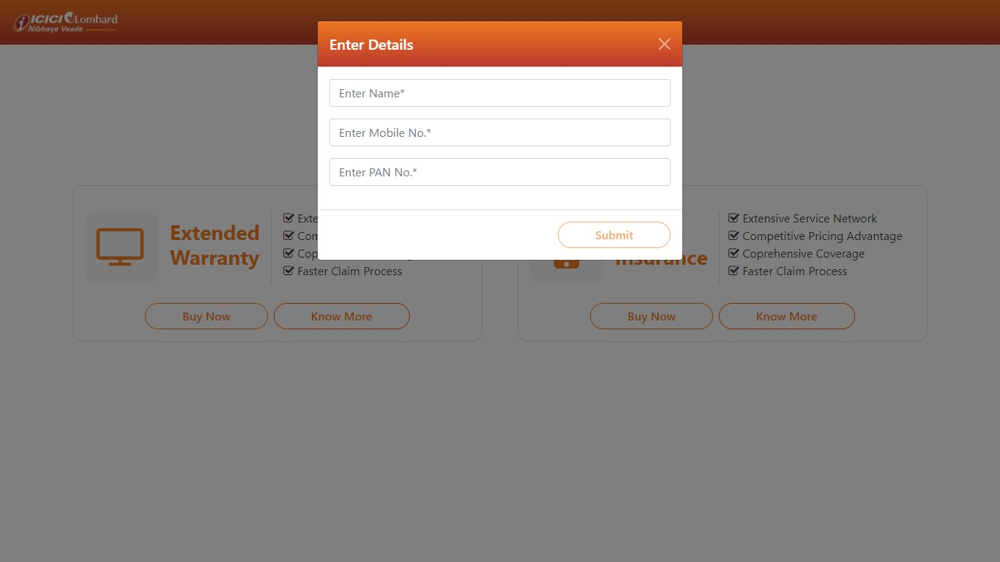
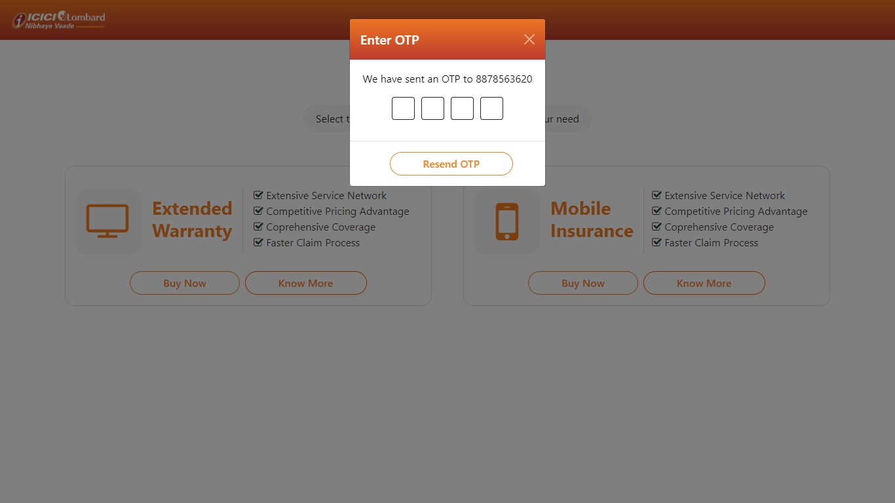
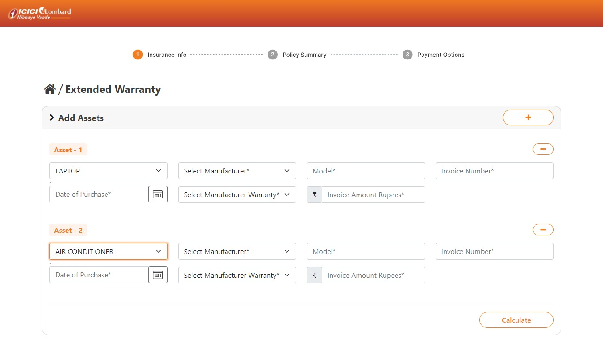
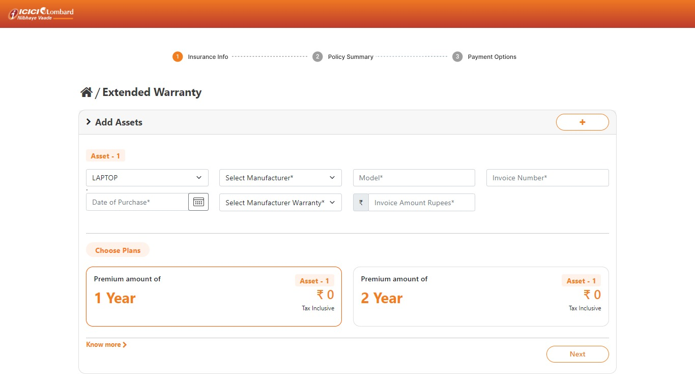
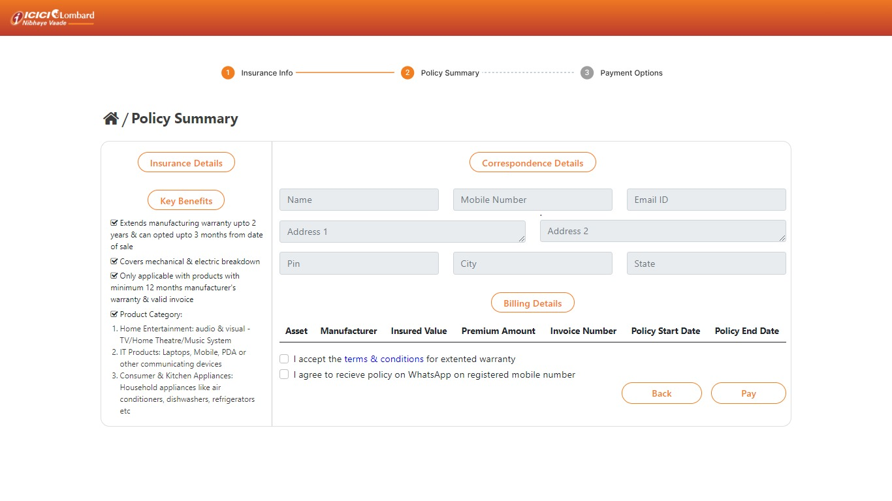

# Insurance Web App

### About

This is an Insurance Web Application (https://insurance-web-app.netlify.app/)  built with __Angular__ for frontend,
__OpenText Appworks__ for creating  Web Services, and __Bootstrap__ for the UI library. It supports all validations for customer users. It is deployed on __Netlify__.

